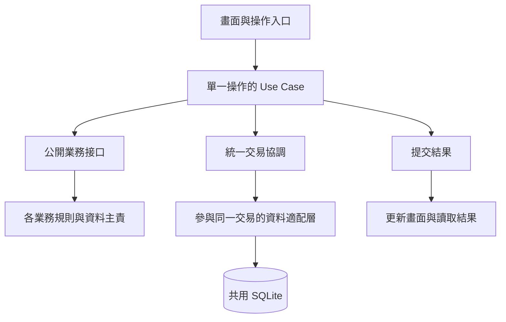

# ExpenseTracker V2 — 整合架構提案

日期：2026-09-26  
狀態：已採用 1A／2A／3A；工程細節待規格與驗證，未開工、未 Freeze  
配套：[Full Vision Baseline](full-vision-baseline.md) · [Architecture Baseline v1.0-rc1](architecture-baseline-v1.0-rc1.md)

本文件把既有決策整理成可審查的程式框架。Full Vision 保存全部願景與原始決策，rc1 管理當期範圍；本提案不取代它們，也不把整理者的建議當成使用者決定。文內「提案」由助手負責細化與驗證；涉及日常體驗及本期範圍的取捨集中在最後三組。選定這三組也不代表技術驗證已完成。

使用者已明確回答「可以就1A2A3A這樣，然後你先規劃實作安排給我看」。決策紀錄見 [Full Vision D-003](full-vision-baseline.md#decision-product-delivery)；後續依賴、批次與驗收安排見[實作計畫](implementation-plan.md)。

## 先看結論

採同一 repository、組裝成同一 App 的模組化架構，按業務拆本機套件；業務內有明確需要可再拆。每個模組負責自己的規則與權威資料，跨模組操作用小型 Use Case 協調，需要一起成功的財務變動在同一 SQLite transaction 提交。

新增功能的正常路徑是「建立自己的業務能力 → 接入公開契約 → 提供 migration／必要 UI／驗證」，而不是在所有舊模組加入特殊判斷。新的財務語意仍可能需要調整核心，必須記錄影響與相容方式，不能承諾零修改。

## 已定案，直接沿用

- Android 優先、Flutter、local-first；本機核心不依賴登入或網路。雲端備份與多裝置同步是不同能力，Sync 延後。
- Modular Monolith、Riverpod 管 UI 狀態與組裝、Domain 管業務規則、Drift + SQLite、UUID v7 與 Workspace 邊界。
- Ledger 保存正式資金紀錄；multi-leg 不自動代表完整會計科目體系。金額精度、跨幣別估值與尾差須有明確規格，不能用不同幣別裸數字相加。
- Refund 是與原交易關聯的新事件，不覆寫原消費；revision、tombstone 與 reversal 分工維持可追溯。
- [D-001：A＋](architecture-baseline-v1.0-rc1.md#a-plus-coordination)：模組主責、小型操作協調、統一提交、重試去重。
- [D-002：按業務拆套件](architecture-baseline-v1.0-rc1.md#module-enforcement-options)：業務內可按需要再拆，數量不作為主要限制。
- [Q124](full-vision-baseline.md#q124)：餘額立即一致；常用報表可稍後更新；重型分析可背景處理，舊結果必須有狀態。
- [Q118～Q120](full-vision-baseline.md#q118)：長期保留 Key Envelope、密碼與 Recovery Key、輪替／health check／文字與 QR。本次 2A 已將最小 envelope、密碼與文字救援金鑰提前至首個可用版本；QR、完整輪替及定期 health check 仍延後。
- 信用卡與股票／ETF 核心仍屬 rc1 CORE；分批交付不能把它們悄悄移出第一階段。

來源：[RC-03](architecture-baseline-v1.0-rc1.md#rc-03)、[RC-06](architecture-baseline-v1.0-rc1.md#rc-06)、[RC-07](architecture-baseline-v1.0-rc1.md#rc-07)、[RC-08](architecture-baseline-v1.0-rc1.md#rc-08)。

## 1. 主業務與資料主責提案

下面是責任清單，不是要同時建立的空套件。套件隨功能進入開發才建立；名稱可在實作前統一，不影響業務邊界。

### 正式財務紀錄

- **Accounts**：帳戶身份、類型、幣別、封存與 lifecycle。提供帳戶可用狀態查詢；不擁有可隨意修改的 current balance。期初餘額是 Ledger 事件。
- **Ledger**：正式 transaction／legs、財務 revision、轉帳、拆分、退款／反轉、結構化 charge、來源關聯及帳本不變條件。提供財務寫入與讀取契約；餘額快取是可重建結果。
- **Categories／Tags／Merchants**：各自擁有分類樹、標籤、商家身份與 alias。作為獨立業務邊界設計；是否進一步拆出 alias 等子套件，按實際需要。這些模組不透過合併、刪除或改名暗中重寫 Ledger 的財務金額。交易分類關聯由交易擁有者維護，引用對方的公開 ID。

### 專門財務業務

- **Credit Cards**：卡片規則、帳單週期、pending／posted 關聯、應繳與繳款分配、基本分期計畫。正式資金影響仍交給 Ledger；繳款分配與資金移動需要時同一提交。
- **Investments**：股票／ETF 交易、instrument 引用、lot／成本與處分規則、股息、基本 split。資金側交給 Ledger；持倉摘要與績效為衍生結果。lot／績效／corporate action 可按需要再拆，但首版不提前完成所有子能力。
- **Budget**：預算規則、期間、分類與帳戶／Tag 條件；從公開財務讀取契約計算已用額度，不保存另一份可編輯消費真相。
- **Recurring**：定期規則、規則版本、occurrence 與待確認狀態；到期不等於入帳。首批提案採確認後才呼叫對應 Use Case，自動入帳保留為後續 CORE 子功能評審，不自行擴大首批範圍。

### 讀取與進出資料

- **Search**：查詢條件與搜尋結果契約；基本搜尋優先查詢已授權的 read contract，有必要才建立索引。預覽結果不能作為直接寫入的依據。
- **Reporting**：收支／分類／資產／績效讀取模型、少量摘要與可重建投影。透過已定義的查詢及更新契約取得資料，不越過模組邊界讀私有表。報表模型不能反向修改業務紀錄。
- **Import／Export**：格式識別、parser、staging、來源身份去重、欄位錯誤與預覽。確認後呼叫既有業務 Use Case；不另建一套繞過 Ledger 的入帳邏輯。首批自有 CSV／JSON，其他格式依 rc1 延後。
- **Backup／Restore**：備份 manifest、版本、各模組資料與附件清單、完整性檢查、還原 orchestration。保存權威資料及必要稽核／去重資訊，衍生快取可重建；不是僅匯出目前畫面上的資料。
- **Security**：App 鎖定、解鎖狀態、安全儲存與隱私呈現的服務契約。業務模組不取得原始密鑰；Backup 使用受控的加解密能力。具體密碼套件與平台適配待技術驗證。

### 市場與未來能力

- **Market Data／FX**：來源、查詢、快取、時點與手動估值契約。歷史成交匯率屬於當時交易的紀錄，不被新行情覆寫。供應商 adapter 的能力、費用與權限需另外核實，不在此虛構已選供應商。
- **Attachments／OCR／Invoice／Reconciliation／Loan／Forecast／Sync 等**：依各自 FV／RC 保留接入、身份、權限及 migration 邊界；只在實際啟用時建立完整套件／資料表。關閉能力不刪除既有財務紀錄。

來源：[RC-05](architecture-baseline-v1.0-rc1.md#rc-05)、[RC-09～RC-20](architecture-baseline-v1.0-rc1.md#rc-09)。細分後的套件責任不能改變原有 CORE／OPTIONAL 範圍。

## 2. 共用基礎與 App 組裝

共用基礎只放已確認的跨業務概念：Money、Currency、Decimal 邊界、ID、Time／Date、Workspace context，以及必要錯誤表示。各業務的專屬規則不放入巨型 common 套件。

技術支援獨立管理：本機 persistence／Unit of Work、migration 協調、persistent jobs、平台 adapter、design system。這些支援業務，但不擁有帳本、信用卡或投資規則。Dependency injection 在 App 組裝入口完成；畫面只呼叫 Use Case 或 read API。

此圖表示執行分工，不把呼叫方向誤當成 Domain 對具體 adapter 的原始碼依賴。Domain 與 Application 只依賴所需契約，組裝層提供實作；同一套件內也要檢查不當引用。

### 依賴與接口規則

- 每個業務提供最小公開入口；其他模組不得 import internal repository、Drift row 或內部 class。
- Ledger 接受可驗證的財務意圖與參與操作的有效資料；取得 Accounts 等資訊時使用明確 port／唯讀契約，由組裝層接線，不使兩個 Domain 相互依賴。
- Accounts 顯示餘額由畫面或 Application 組合 Accounts 與 Ledger 的結果，不把餘額反向塞進 Accounts Domain，避免循環。
- 接口最少交代輸入、輸出、workspace、operation ID／expected version、錯誤及同一交易的參與方式。依操作需要使用欄位，不強迫每個查詢承擔完整命令框架。
- 對外錯誤區分驗證失敗、資料衝突、能力未啟用、provider 暫不可用與儲存失敗；不可用空值或 0 假裝成功。
- 公開 ID 與業務值跨邊界；資料庫 handle／內部 row ID 留在資料層。公開契約不能把整個資料庫結構帶出去。

## 3. 寫入、查詢與資料演進

### 一次完整寫入

使用者命令 → 讀取與驗證當前狀態 → 各業務計算自己的結果 → 核對跨模組金額／幣別／來源關聯 → 保存權威資料、Audit、去重結果與必要後續工作 → 同一 transaction 提交 → 回傳已提交結果。

依 [D-001](architecture-baseline-v1.0-rc1.md#a-plus-coordination)，同一 operation ID 重試回到同一結果；輸入不同則拒絕冒用。預覽不具入帳效力；提交時重新驗證狀態，條件變更不能靜默代替使用者確認。外部網路請求不放在 SQLite transaction 內。

### 讀取與投影

Ledger 是正式資金來源，Investment 的正式交易與 lot 等仍由對應業務擁有。金融全貌不能假設只靠 Ledger 金額就能恢復所有非資金資訊。查詢使用各模組的公開讀取契約；需要一致結果的跨模組查詢使用同一讀取快照或明確版本檢查，不混用不同時間的數字卻標成即時總額。

先使用 rc1 的少量投影，其餘用有索引的查詢。Account balance 等關鍵結果與寫入一致；後續報表可延後，但必須有持久待更新訊號／版本與重建路徑。畫面標示來源日期、更新中及必要的估值差異。報表失敗不把已提交的交易改成儲存失敗。

### Migration、備份與停用

各模組提出自己擁有的 schema 變更，App 的 migration manifest 統一安排跨模組依賴與版本。子套件不各自偷偷啟動 migration。一般 migration 用交易；重大變更先備份，再以複本驗證後切換。

Backup 必須涵蓋已存在資料的所有模組，即使該模組 UI 暫時關閉。manifest 明列模組與版本；遇到無法解讀的必要資料版本時拒絕正式還原，不能跳過後宣稱完整成功。先在暫存區驗證，再可恢復地替換正式資料；衍生資料依版本重建。

正式取消、退款與更正走業務流程；永久清除是另有風險與驗收的能力，不因套件拆分順便實作。來源：[RC-14](architecture-baseline-v1.0-rc1.md#rc-14)、[RC-25](architecture-baseline-v1.0-rc1.md#rc-25)。

## 4. 助手負責收斂的規格，不逐項要求使用者投票

以下是待寫成具體規格並驗證的工程工作，不是已通過的實作：

- Ledger 事件／revision／退款上限／reversal 的狀態轉移與跨幣別 invariant。未來額外補償超過原消費時另用正確事件，不擴大原退款上限掩蓋差額。
- 幣別精度與 Decimal 序列化、分攤尾差、Money／Time 格式；區分業務日期與時間瞬間，不將空缺日期語意混填。
- 分期的負債／費用／繳款分工、Average Cost／FIFO、split 與 XIRR 的具體案例。固定費用依來源與計畫明確分配，不推測未支援的利率條件。
- 基本分期消費與付款使用同一筆原始交易及不同讀取口徑，不能每期再新增重複消費；跨期退款保留實際退款日期與原交易關聯，原月淨消費調整僅作另有標示的分析。
- 基本 recurring 提案：月底缺日取當月最後一天、保留原規則日以避免三月跟著漂移；首次採待確認，不靜默回補過往正式交易。改動既有已定案規則時須明示差異，不能以工程細化名義覆蓋。
- 加密格式／KDF／安全儲存／密鑰生命週期、異機還原驗證；不自製加密原語，不在尚未選用及驗證前宣稱安全。
- operation ID 保存與清理、還原後去重相容性、jobs／outbox 原子性、projection 與契約版本。
- 靜態依賴檢查、契約測試、失敗注入、migration fixture、效能基線、CI／簽章／發布追溯。

以上對應 [ADR-01～ADR-08](architecture-baseline-v1.0-rc1.md#rc-22)。若細化真的出現會改變使用者財務呈現、權限、費用或資料可救回性的取捨，再集中更新相關決策組，不另外連續展開大量小題。

## 5. 三組已選定方向與保留的比較

使用者已選 **1A、2A、3A**；B／C 選項保留為比較紀錄，沒有採用。選擇只批准該選項明示的體驗／範圍；不代表其餘細節均已驗證或整體架構已 Freeze。

### 第 1 組：日常首頁與預算以哪種數字為主

共同底層提案：原消費、分期計畫、實際付款及退款分別保存，不能重複計費。以下改變主要呈現口徑，不刪除任何另一種資料。分期、帳單與投資的精確計算仍由工程規格驗證。

**1A｜消費為主，付款安排另看（已選）。** 例如 30,000 元購買分 10 期，消費報表與消費預算記購買月份 30,000 元；每期 3,000 元顯示在當期應繳／付款安排。繳款不再列一次消費。實際退款在退款期記錄減項並連到原消費；歷史分類淨消費的重算另標示口徑。

- 優點：能直接回答「這個月買了多少」，避免分期掩蓋購買總額；最容易與分類消費核對。
- 代價：大筆分期當月消費會偏高，要看每月負擔需查看付款安排。

**1B｜付款安排為主，消費分析另看。** 首頁優先呈現本期已付、待付與分期負擔；購買總額仍在消費報表。付款安排包括尚未發生的預計應繳，必須區分已付／待付，不冒充實際現金流水。消費預算仍按明確消費口徑計算，不與付款安排混加；若未來需要獨立「付款預算」，另行擴充。

- 優點：較容易掌握當期要準備多少錢。
- 代價：首頁主數字與消費預算不是同一口徑，需要清楚標示並切換查看；不能直接把每月應繳當成當月購買額。

本組對應 [RC-02](architecture-baseline-v1.0-rc1.md#rc-02)、[RC-07](architecture-baseline-v1.0-rc1.md#rc-07)、[RC-09](architecture-baseline-v1.0-rc1.md#rc-09)、[RC-13](architecture-baseline-v1.0-rc1.md#rc-13)。1B 會調整既有首頁優先呈現順序；1A 延續收支／消費導向。兩者均不把信用卡還款再列消費。

### 第 2 組：首個可用版本的備份解鎖範圍

長期方向已選 Key Envelope、密碼與 Recovery Key，不重問要不要長期支援。這次選擇最新 review 減重後，要在哪一批把使用者保管救援材料的功能做完。App PIN／生物辨識與可攜備份密碼分開，不假設登入帳號就能解密。

**2A｜首批就有備份密碼＋文字救援金鑰（已選）。** 把最小 envelope 與兩條解鎖路徑提前到首個可用版本；平常使用 App 不需每次輸入救援金鑰。首次設定時引導另行保存，並驗證密碼及救援金鑰都能在乾淨環境還原。QR、完整輪替管理與定期 health check 仍按後續 scope 實作。

- 優點：第一批真實資料就有密碼遺失後的另一條解鎖路徑，也延續長期方向。
- 代價：首批多一段設定、保存與還原驗證；使用者需妥善保存救援金鑰。密碼與救援材料都失去且無其他有效解鎖路徑時，無法承諾救回。

**2B｜首批只用備份密碼，救援金鑰後續加入。** 首批仍需有完整加密、驗證與異機還原，格式保留演進路徑；不以原裝置限定的密鑰冒充可攜備份。

- 優點：首批設定較簡單、交付範圍較小。
- 代價：對只有密碼可解鎖的備份，忘記密碼後不能靠 App PIN 或登入帳號解開；未來新增救援金鑰，也不會自動讓先前已失去解鎖能力的舊備份可救回。

本組對應 [Q020](full-vision-baseline.md#q020)、[Q118～Q120](full-vision-baseline.md#q118)、[RC-14](architecture-baseline-v1.0-rc1.md#rc-14)。2A 已獲明確採用，rc1 已同步更新最小 envelope 與文字救援金鑰的交付範圍。

### 第 3 組：第一個給使用者日常試用的版本包含哪些功能

所有方案都依序完成單項功能並驗證；差別在何時交付日常試用版本。每個可用版本都要具備該範圍所需的安全、migration、加密備份與乾淨環境還原，不把資料保護留到最後。首個試用版本不等於 rc1 全部 CORE 已完成。

**3A｜日常記帳先用，再信用卡，最後投資（已選）。** 第一批完成帳戶／期初餘額、分類／Tag／Merchant、收入支出、轉帳／拆分／退款／更正、多幣別基礎、搜尋與基本報表、自有 CSV／JSON、必要安全及備份還原。下一批補 Budget／Recurring／提醒及信用卡／基本分期，再完成股票／ETF 核心；先後可依具體依賴微調，每項都維持完整驗收。

- 優點：較早拿真實日常流程驗證地基，發現問題時修改範圍較小。
- 代價：信用卡專用流程、預算自動化及投資要等後批；不能先用一般支出冒充尚未實作的投資或卡片流程。

**3B｜日常記帳＋信用卡一起作為首個試用版本。** 先把日常功能與信用卡／基本分期及必要提醒做完再交付，投資下一批。

- 優點：若主要消費都刷卡，首個試用版本較貼近日常需求。
- 代價：首批等待較久，需同時完成帳單跨期與分期等更多驗證。

**3C｜完成全部 rc1 CORE 才交付日常試用版本。** 內部仍逐功能開發驗證，使用者日常試用等到信用卡、投資、Budget／Recurring 等核心都完成。

- 優點：第一次日常使用的功能範圍較完整。
- 代價：使用者對真實日常流程的回饋較晚，首批整合驗證範圍最大。

本組對應 [RC-22](architecture-baseline-v1.0-rc1.md#rc-22)。無論選何者，rc1 的第一階段完成定義維持不變，延後批次仍需完成所有已承諾 CORE；不承諾未估算的日期。

## 6. 方向確認後如何落地

1. 將使用者的三組選擇原文記入 Full Vision，更新 rc1 的受影響範圍與契約，未選的保留待決。
2. 助手完成主模組依賴圖、核心資料模型、接口與錯誤、migration manifest，以及上述八組 ADR 的具體規格；不把每個工程細節改成新的使用者問卷。
3. 先完成文件一致性、財務代表案例與擴充邊界審查；必要原型只在方向確認後按待驗證事項執行。使用者目前要求先定方向，這份提案不授權提前寫功能。
4. 實測交易原子性、重試、跨期／跨幣別、migration 和乾淨環境還原；使用已實作的真實路徑，不用 stub 取得通過結果。
5. 通過相關 gate 才建立可追溯的架構基線並逐功能交付。三組選項被接受、文件連結正確或建好套件，都不等於程式已完成或整體 Freeze。

已採用的組合為 **1A／2A／3A**，不再要求重選。具體安排見[實作計畫](implementation-plan.md)；使用者其後已授權開始工作，私人 repository 已建立，目前先完成[前置準備](development-readiness.md)，尚未進功能實作。
